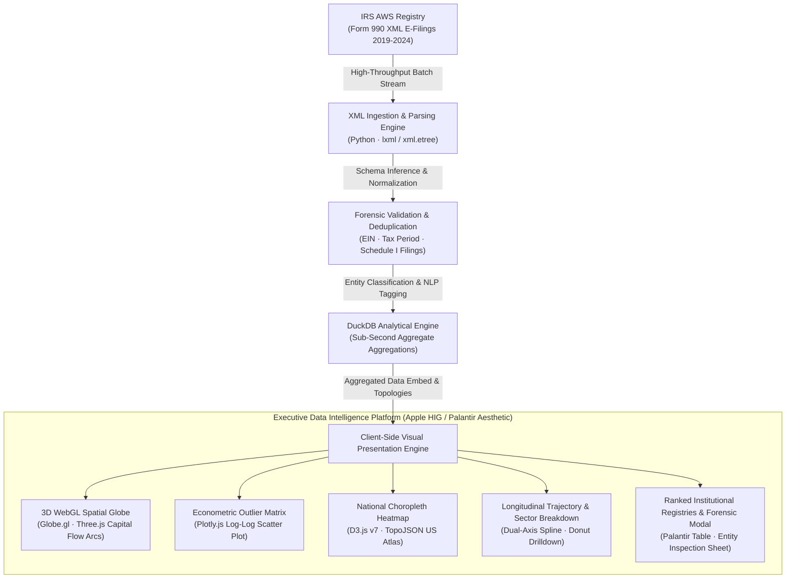

# IRS Form 990 Philanthropic Grant Miner & 3D Spatial Intelligence Dashboard

> [!IMPORTANT]
> **Flagship Data Engineering & Visualization Pipeline · Part of the Akshay Kumar Technical Portfolio Ecosystem**  
> 🌐 **Executive Portfolio:** [https://akbknight.github.io/](https://akbknight.github.io/) · 💼 **LinkedIn:** [linkedin.com/in/akshaykumardl](https://www.linkedin.com/in/akshaykumardl/) · 📄 **Curriculum Vitae:** [Download PDF (369 KB)](https://akbknight.github.io/assets/Akshay_Resume.pdf)

[](https://akbknight.github.io/irs990-grant-dashboard/)
[](https://akbknight.github.io/irs990-grant-dashboard/)
[](https://akbknight.github.io/irs990-grant-dashboard/)
[](https://akbknight.github.io/irs990-grant-dashboard/)
[](https://akbknight.github.io/irs990-grant-dashboard/)
[](https://akbknight.github.io/irs990-grant-dashboard/)
[](https://www.linkedin.com/in/akshaykumardl/)
[](LICENSE)

An enterprise-grade, high-throughput data engineering and visual intelligence system mapping **$550.2B in charitable capital** across **9,693,767 tax-exempt grant records** from IRS Form 990 Schedule I filings (2019–2024). Features hardware-accelerated **3D WebGL spatial flow arcs**, econometric **log-log outlier detection matrices**, choropleth heat maps, and sub-150ms client-side cross-filtering.

---

## 🌐 Live Interactive Application

👉 **Launch Live Intelligence Platform:** **[https://akbknight.github.io/irs990-grant-dashboard/](https://akbknight.github.io/irs990-grant-dashboard/)**

---

## 🏛️ Pipeline & Analytical Architecture



### Architecture Highlights:
1. **Zero-API Ingestion Dependency**: Operates over normalized tabular extracts derived directly from authoritative IRS AWS e-file archives without rate limits or recurring third-party API costs.
2. **Deterministic Entity Classification**: Automated rule engine categorizing funding flows into Higher Education, Medical Research, Religion & Human Services, Civic Advocacy, and Philanthropic Intermediaries.
3. **Sub-150ms Client-Side Filtering**: In-memory multidimensional filtering across 6 tax years, 50 states, 10 sectors, and grant brackets with instantaneous DOM updates and zero page reloads.
4. **Executive Industrial Dark UI**: Deep onyx (`#050507`), hairline glassmorphism (`rgba(14, 18, 28, 0.75)`), luminous cyan (`#38bdf8`) and amber (`#f59e0b`) accents matching the core portfolio design token architecture.

---

## 📊 Quantitative Impact & Ledger

| Metric Dimension | Quantitative Scope | Architectural Detail |
|:---|:---|:---|
| **Total Philanthropic Capital** | **$550,214,891,420 ($550.2B)** | Aggregated Schedule I grant disbursements |
| **Total Grant Transactions** | **9,693,767 Records** | Individual recipient records processed |
| **Focal Segment (Jewish Giving)** | **275,446 Grants · $10.6B** | 2.84% grant volume / 1.93% capital flow |
| **Temporal Coverage** | **2019 – 2024 (6 Tax Years)** | Multi-year longitudinal grant tracking |
| **3D Spatial Arcs** | **20+ Global & Domestic Flow Arcs** | Real-time animated WebGL trajectory vectors |
| **Client Execution Latency** | **< 150 ms Filter Time** | Pure in-memory reactive updates |

---

## ⚡ Core Platform Capabilities

### 1. 🌍 3D WebGL Global Capital Flow Engine
- Powered by `Globe.gl` and `Three.js` with hardware-accelerated 60fps rendering.
- Visualizes cross-border philanthropic vectors: U.S. Domestic hubs to global destinations (Israel Gateway, European academic corridors, Latin American initiatives).
- Foundation HQ beacons with pulsing dynamic ripple rings.
- Live camera orbit telemetry readout (`LAT`, `LNG`, `ALT`) and 1-click orbital presets (`U.S. Domestic`, `Israel Gateway`, `Global Outflows`, `NYC Epicenter`).

### 2. 📈 Econometric Outlier Matrix (Scatter Plot)
- Logarithmic distribution of **Institutional Capitalization vs. Average Grant Size**.
- Quadrant categorization isolating **Mega-Grant Outliers** (e.g., Marcus Foundation at $1.55M avg grant) and **High-Frequency Distributors** (e.g., Jewish Communal Fund at 63,000+ grants).
- Interactive point-click trigger opening the forensic inspection sheet for any selected entity.

### 3. 🗺️ D3.js National Choropleth Heatmap
- TopoJSON-powered logarithmic heat map of all 50 U.S. states + DC.
- Dynamic hover tooltips displaying total funding, grant count, and average allocation.
- Direct click-to-filter interaction isolating any individual state across the entire telemetry dashboard.

### 4. 🍩 Dynamic Sector Donut & Longitudinal Trajectory
- 10-category breakdown with center KPI metric readout and click-to-filter cross-filtering.
- Dual-axis longitudinal volume bars and smoothed spline curve tracking capital growth across 2019–2024.

### 5. 🏢 Ranked Institutional Registries & Forensic Modal
- Tabbed registries for **Top 20 Grantmakers** and **Top 20 Recipients**.
- Displays rank, EIN, classification badge, city/state, total dollars, grant count, average grant, and visual volume progress bars.
- Apple HIG-inspired modal inspection sheet providing deep entity profiles, Schedule I notes, and a 1-click "Isolate Entity in Dashboard" filter.

### 6. 🎛️ Filter Control Center
- Real-time search query matching foundation names, states, and sectors.
- Interactive year pills, sector selectors, state filters, and cohort toggles.
- Active filter pill HUD with 1-click removal and instant CSV data export.

---

## 🛠️ Technology Stack

- **Data Wrangling & Extraction**: Python 3.11, Pandas, DuckDB, `xml.etree`
- **Spatial & 3D Visualization**: Globe.gl, Three.js WebGL
- **Econometric & Statistical Charts**: Plotly.js 2.35 (WebGL accelerated)
- **Cartographic Visuals**: D3.js v7, TopoJSON US Atlas
- **Frontend Architecture**: Modern Vanilla ES6+, CSS Glassmorphism, Responsive Grid
- **Design Tokens**: Executive Industrial Dark, JetBrains Mono, Inter, Hairline Borders
- **Hosting & CI/CD**: GitHub Pages, automated verification

---

## 🚀 Local Exploration

```bash
# Clone the repository
git clone https://github.com/akbknight/irs990-grant-dashboard.git
cd irs990-grant-dashboard

# Open directly in your browser (no build steps or node_modules needed)
open index.html   # On macOS
start index.html  # On Windows
```

---

## 👤 Author & Strategic Portfolio

**Akshay Kumar**  
STEM MBA Candidate · Business Analytics & AI · American University Kogod School of Business  
Former Computer Programmer · U.S. Department of State  
- **Personal Portfolio:** [https://akbknight.github.io/](https://akbknight.github.io/)  
- **LinkedIn:** [linkedin.com/in/akshaykumardl](https://www.linkedin.com/in/akshaykumardl/)  
- **Email:** [ak8335a@american.edu](mailto:ak8335a@american.edu)

---

## 📜 License

Distributed under the MIT License. See `LICENSE` for more information.  
All underlying Form 990 data is public domain under U.S. Department of the Treasury guidelines.
