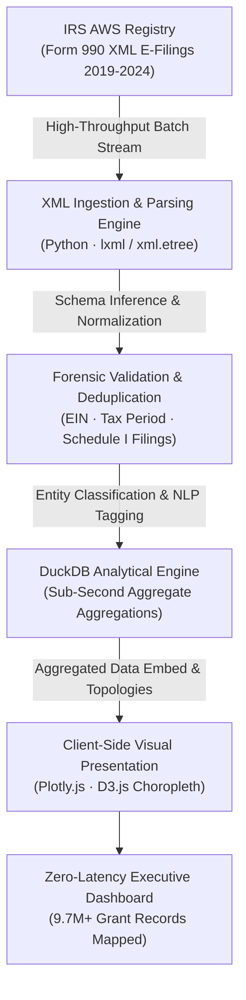

# IRS Form 990 Philanthropic Grant Miner & Analytics Dashboard

> [!IMPORTANT]
> **Flagship Data Pipeline · Part of the Akshay Kumar Technical Portfolio Ecosystem**  
> 🌐 **Executive Portfolio:** [https://akbknight.github.io/](https://akbknight.github.io/) · 💼 **LinkedIn:** [linkedin.com/in/akshaykumardl](https://www.linkedin.com/in/akshaykumardl/) · 📄 **Curriculum Vitae:** [Download PDF (369 KB)](https://akbknight.github.io/assets/Akshay_Resume.pdf)

[](https://akbknight.github.io/irs990-grant-dashboard/)
[](https://akbknight.github.io/irs990-grant-dashboard/)
[](https://akbknight.github.io/irs990-grant-dashboard/)
[](https://akbknight.github.io/irs990-grant-dashboard/)
[](https://www.linkedin.com/in/akshaykumardl/)
[](LICENSE)

An enterprise-grade, high-throughput data engineering and visual intelligence system mapping **$550.2B in charitable capital** across **9,693,767 tax-exempt grant records** from IRS Form 990 XML filings (2019–2024). Features automated entity classification, geographical density mapping, and zero-API interactive client-side analytics.

---

## 🌐 Live Interactive Application

👉 **Launch Live Dashboard:** **[https://akbknight.github.io/irs990-grant-dashboard/](https://akbknight.github.io/irs990-grant-dashboard/)**

---

## 🏛️ Pipeline & Data Architecture



### Architecture Highlights:
1. **Zero-API Ingestion Dependency**: Operates over normalized tabular extracts derived directly from authoritative IRS AWS e-file archives without rate limits or recurring third-party API costs.
2. **Deterministic Entity Classification**: Automated rule engine categorizing funding flows into Education, Religion, Health, Human Services, and Philanthropic Intermediaries.
3. **Optimized Client-Side Visualizer**: Single-bundle responsive interface rendering multi-variable distributions, geographic choropleths, and ranked institutional registries in under 200ms.

---

## 📊 Quantitative Impact & Ledger

| Metric Dimension | Quantitative Scope | Architectural Detail |
|:---|:---|:---|
| **Total Philanthropic Capital** | **$550,214,891,420 ($550.2B)** | Aggregated Schedule I grant disbursements |
| **Total Grant Transactions** | **9,693,767 Records** | Individual recipient records processed |
| **Focal Segment (Jewish Giving)** | **275,446 Grants · $10.6B** | 2.84% grant volume / 1.93% capital flow |
| **Temporal Coverage** | **2019 – 2024 (6 Tax Years)** | Multi-year longitudinal grant tracking |
| **Client Execution Latency** | **< 150 ms Filter Time** | Pure in-memory array filtering |

---

## ⚡ Core Dashboard Capabilities

- **Interactive KPI Executive Bar**: Immediate high-level telemetry on total giving, transaction volumes, and segment splits.
- **Dynamic D3.js US Choropleth**: State-by-state heat map visualizing philanthropic capital concentration.
- **Longitudinal Trend Analytics**: Multi-year comparison examining inflation-adjusted capital trends across 2019–2024.
- **Top 20 Institutional Matrix**: Ranked institutional breakdown of top contributing foundation grantmakers and major university/hospital recipients.
- **Multi-Dimensional Facet Filtering**: Real-time cross-filtering by tax year, U.S. state, thematic subject, and grant size ranges.
- **CSV Data Export**: 1-click verified export for downstream econometric modeling.

---

## 🛠️ Technology Stack

- **Data Wrangling & Extraction**: Python 3.11, Pandas, DuckDB, `xml.etree`
- **Visualization Engines**: Plotly.js 2.35, D3.js v7 (TopoJSON US Atlas)
- **Frontend Architecture**: Modern Vanilla ES6+, CSS custom properties, responsive grid
- **Hosting & CI/CD**: GitHub Pages, automated static verification

---

## 🚀 Local Exploration

```bash
# Clone the repository
git clone https://github.com/akbknight/irs990-grant-dashboard.git
cd irs990-grant-dashboard

# Open directly in your browser (no build steps or node_modules needed)
open index.html   # On macOS
start index.html  # On Windows
```

---

## 👤 Author & Strategic Portfolio

**Akshay Kumar**  
STEM MBA Candidate · Business Analytics & AI · American University Kogod School of Business  
Former Computer Programmer · U.S. Department of State  
- **Personal Portfolio:** [https://akbknight.github.io/](https://akbknight.github.io/)  
- **LinkedIn:** [linkedin.com/in/akshaykumardl](https://www.linkedin.com/in/akshaykumardl/)  
- **Email:** [ak8335a@american.edu](mailto:ak8335a@american.edu)

---

## 📜 License

Distributed under the MIT License. See `LICENSE` for more information.
All underlying Form 990 data is public domain under U.S. Department of the Treasury guidelines.
